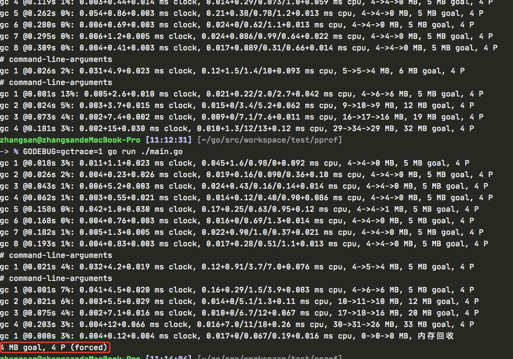
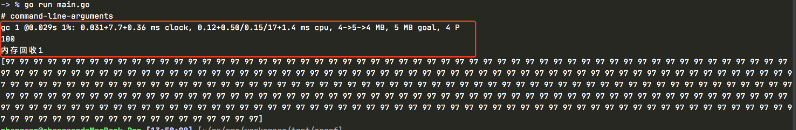
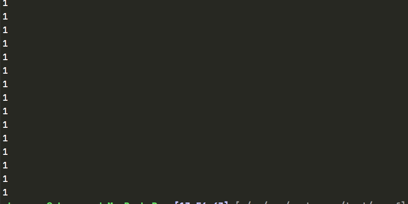
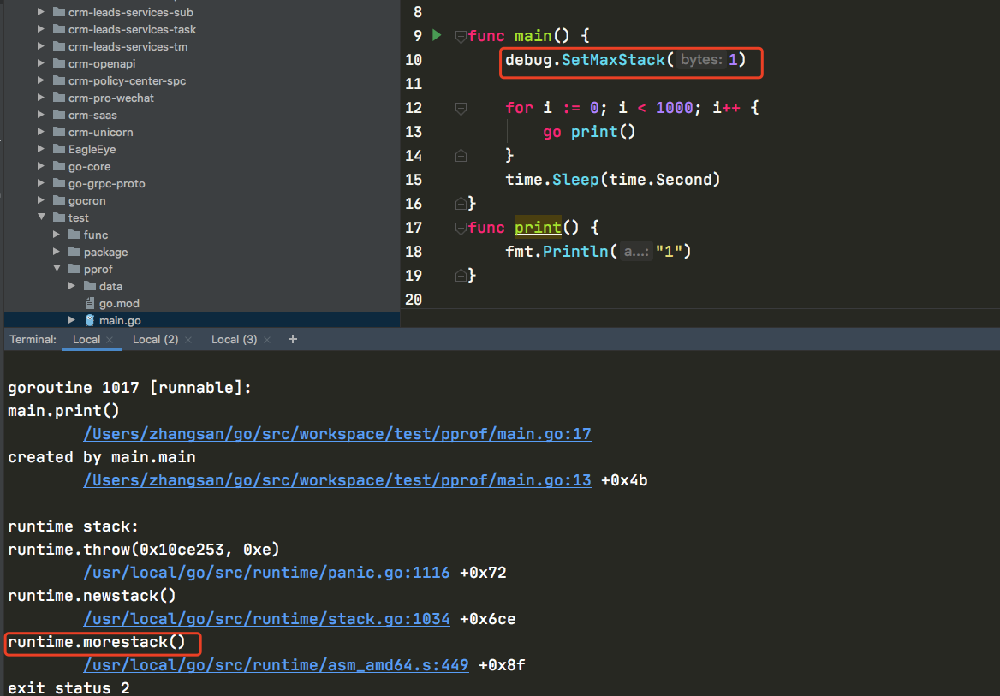
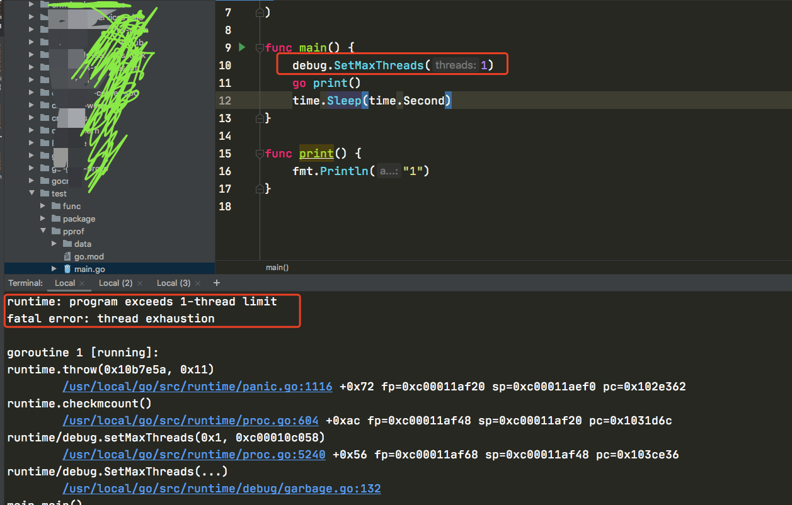
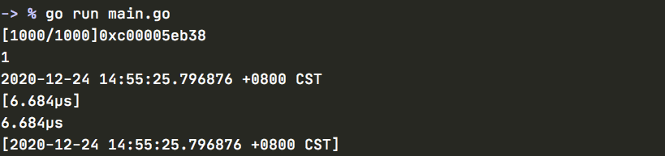
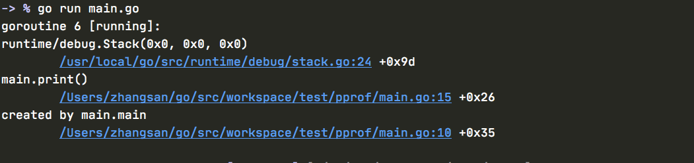
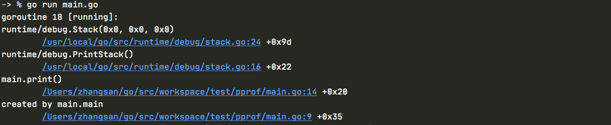

# debug

	# 1、查看程序GC过程

```
GODEBUG=gctrace=1 go run ./main.go
```


# 1、强制垃圾回收

```
func FreeOsMemory()
```

FreeOSMemory强制进行一次垃圾收集，以释放尽量多的内存回操作系统。（即使没有调用，运行时环境也会在后台任务里逐渐将内存释放给系统）

<font color=red size=5x>**demo**</font>

```go
package main

import (
	"fmt"
	"runtime"
	"runtime/debug"
	"time"
)

func main() {
	var dic = new(map[string]string)
	runtime.SetFinalizer(dic, func(dic *map[string]string) {
		fmt.Println("内存回收")
	})
	debug.FreeOSMemory()
	time.Sleep(time.Second)
}

```

<font color=red size=5x>runtime.SetFinalizer 保证此次内存不会在此次被回收</font>

<font color=green size=5x>而debug.FreeOSMemory() 强制回收本次内存使用</font>



==command-line-arguments==

<font color=red size=5x>gc 1 @0.029s 1%: 0.031+7.7+0.36 ms clock, 0.12+0.50/0.15/17+1.4 ms cpu, 4->5->4 MB, 5 MB goal, 4 P</font>

<font color=#eedc31 size=4x>1 表示第一次执行</font>

<font color=blue size=4x>@0.029s 表示程序执行的时间</font>

<font color=green size=4x>1% 垃圾回收占用的百分比</font>

<font color=red size=4x>0.031+7.7+0.36 ms clock 垃圾回收的时间，分别为STW清扫的时间，并发标记和扫描的时间，STW标记的时间</font>

<font color=#eedc31 size=4x>0.12+0.50/0.15/17+1.4 ms cpu： 垃圾回收占用CPU的时间</font>

<font color=green size=4x>4->5->4 MB 堆的大小，gc后堆的大小，存活的堆的大小</font>

<font color=red size=4x> 5 MB goal： 整体堆的大小</font>

<font color=green size=4x>4P ： 使用的处理器的数量</font>

# 3、设定垃圾回收的百分比

```
func SetGCPercent(percent int) int
```

SetGCPercent设定垃圾收集的目标百分比：当新申请的内存大小占前次垃圾收集剩余可用内存大小的比率达到设定值时，就会触发垃圾收集。SetGCPercent返回之前的设定。初始值设定为环境变量GOGC的值；如果没有设置该环境变量，初始值为100。percent参数如果是负数值，会关闭垃圾收集。

<font color=red size=5x>**demo**</font>

```go
package main

import (
	"fmt"
	"runtime"
	"runtime/debug"
	"time"
)

func main() {
	fmt.Println(debug.SetGCPercent(1))

	// 1
	var dic = make([]byte, 100, 100)
	runtime.SetFinalizer(&dic, func(dic *[]byte) {
		fmt.Println("内存回收1")
	})

	// 立即回收
	runtime.GC()

	// 2
	var s = make([]byte, 100, 100)
	runtime.SetFinalizer(&s, func(dic *[]byte) {
		fmt.Println("内存回收2")
	})

	// 3
	d := make([]byte, 300, 300)
	for index, _ := range d {
		d[index] = 'a'
	}
	fmt.Println(d)

	time.Sleep(time.Second)
}

```

1处创建了100字节的空间，延迟释放，然后调用runtime。GC立马释放空间，2处我们又创建了一块100字节的内存，等待回收，当我们执行到3的时候，创建了一个300字节的内存，已大于垃圾回收剩余内存，所以系统继续立即回收内存




==command-line-arguments==

<font color=red size=5x>gc 1 @0.029s 1%: 0.031+7.7+0.36 ms clock, 0.12+0.50/0.15/17+1.4 ms cpu, 4->5->4 MB, 5 MB goal, 4 P</font>

<font color=#eedc31 size=4x>1 表示第一次执行</font>

<font color=blue size=4x>@0.029s 表示程序执行的时间</font>

<font color=green size=4x>1% 垃圾回收占用的百分比</font>

<font color=red size=4x>0.031+7.7+0.36 ms clock 垃圾回收的时间，分别为STW清扫的时间，并发标记和扫描的时间，STW标记的时间</font>

<font color=#eedc31 size=4x>0.12+0.50/0.15/17+1.4 ms cpu： 垃圾回收占用CPU的时间</font>

<font color=green size=4x>4->5->4 MB 堆的大小，gc后堆的大小，存活的堆的大小</font>

<font color=red size=4x> 5 MB goal： 整体堆的大小</font>

<font color=green size=4x>4P ： 使用的处理器的数量</font>

# 4、设置单个go协程调用栈内存最大值

<font color=green size=4x>默认设置在32位系统是250MB，在64位系统是1GB。</font>

```
func SetMaxStack(bytes int) int
```

SetMaxStack设置该以被单个go程调用栈可使用的内存最大值。如果任何go程在增加其调用栈时超出了该限制，程序就会崩溃。SetMaxStack返回之前的设置。默认设置在32位系统是250MB，在64位系统是1GB。

SetMaxStack主要用于限制无限递归的go程带来的灾难。 它只会限制未来增长的调用栈。


<font color=red size=5x>**demo**</font>

```go
package main

import (
	"fmt"
	"os"
	"runtime/debug"
	"time"
)

func main() {

	for i := 0; i < 1000; i++ {
		go print()
	}
	time.Sleep(time.Second)
}
func print() {
	fmt.Println("1")
}

```

正常输出




```go
package main

import (
	"fmt"
	"runtime/debug"
	"time"
)

func main() {
	debug.SetMaxStack(1)

	for i := 0; i < 1000; i++ {
		go print()
	}
	time.Sleep(time.Second)
}
func print() {
	fmt.Println("1")
}

```




# 5、设置go程序可以使用的最大操作系统线程数

```
func SetMaxThreads(threads int) int
```

SetMaxThreads设置go程序可以使用的最大操作系统线程数。如果程序试图使用超过该限制的线程数，就会导致程序崩溃。SetMaxThreads返回之前的设置，初始设置为10000个线程。

该限制控制操作系统线程数，而非go程数。go程序只有在一个go程准备要执行，但现有的线程都阻塞在系统调用、cgo调用或被runtime.LockOSThread函数阻塞在其他go程时，才会创建一个新的线程。

SetMaxThreads主要用于限制程序无限制的创造线程导致的灾难。目的是让程序在干掉操作系统之前，先干掉它自己。

<font color=red size=5x>**demo**</font>

```go
package main

import (
	"fmt"
	"runtime/debug"
	"time"
)

func main() {
	debug.SetMaxThreads(1)
	go print()
	time.Sleep(time.Second)
}

func print() {
	fmt.Println("1")
}

```





# 6、设置程序请求运行是只出发panic，而不崩溃

```
func SetPanicOnFault(enabled bool) bool
```

暂时无案例


# 7、GC收集信息的写入stats中

```
func ReadGCStats(stats *GCStats)
```

```
type GCStats struct {
    LastGC         time.Time       // 最近一次垃圾收集的时间
    NumGC          int64           // 垃圾收集的次数
    PauseTotal     time.Duration   // 所有暂停收集垃圾消耗的总时间
    Pause          []time.Duration // 每次暂停收集垃圾的消耗的时间
    PauseQuantiles []time.Duration
}
```

<font color=red size=5x>**demo**</font>

```go
package main

import (
	"fmt"
	"runtime"
	"runtime/debug"
)

func main() {
	data := make([]byte, 1000, 1000)
	println(data)
	runtime.GC()

	var stats debug.GCStats
	debug.ReadGCStats(&stats)
	fmt.Println(stats.NumGC)
	fmt.Println(stats.LastGC)
	fmt.Println(stats.Pause)
	fmt.Println(stats.PauseTotal)
	fmt.Println(stats.PauseEnd)
}

```





# 8、获取go协程调用栈信息

Stack 返回格式化的go程的调用栈踪迹。 对于每一个调用栈，它包括原文件的行信息和PC值；对go函数还会尝试获取调用该函数的函数或方法，及调用所在行的文本。

此函数已废弃。请使用runtime包中的Stack函数代替。

```
func Stack() []byte
```


```go
package main

import (
	"fmt"
	"runtime/debug"
	"time"
)

func main() {
	go print()
	time.Sleep(time.Second)
}

func print() {
	fmt.Println(string(debug.Stack()))
}

```



## runtime查看更多信息

```go
package main
 
import (
   "time"
  "runtime"
  "fmt"
)
 
func main() {
 go print()
 time.Sleep(time.Second)
}
 
func print(){
  callers := make([]uintptr,100)
  n:=runtime.Callers(1,callers)
  for _,pc:= range callers[:n]{
    funcPc := runtime.FuncForPC(pc)
    fmt.Println(funcPc.Name())
    fmt.Println(funcPc.FileLine(pc))
  }
}
```


# 9、将内存分配堆和其中对象的描述写入文件中

```
func WriteHeapDump(fd uintptr)
```

WriteHeapDump将内存分配堆和其中对象的描述写入给定文件描述符fd指定的文件。


```go
package main

import (
	"os"
	"runtime"
	"runtime/debug"
)

func main() {
	fd, _ := os.OpenFile("/Users/zhangsan/go/src/workspace/test/pprof/log.txt", os.O_RDWR|os.O_CREATE, 0666)
	debug.WriteHeapDump(fd.Fd())
	data := make([]byte, 10, 10)
	println(data)
	runtime.GC()
}

```


# 10、将Stack返回信息打印到标准错误输出

```
func PrintStack()
```


```go
package main

import (
	"runtime/debug"
	"time"
)

func main() {
	go print()
	time.Sleep(time.Second)
}

func print() {
	debug.PrintStack()
}

```


	


