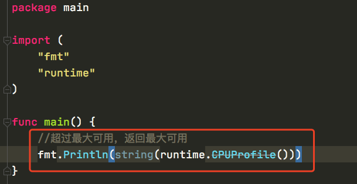

# 1、runtime.GOARCH 平台架构

```go
package main

import (
	"fmt"
	"runtime"
)

func main() {

	fmt.Println(runtime.GOARCH)
}

```


```
-> % go run test2.go
amd64
```


# 2、目标系统

```go
package main

import (
	"fmt"
	"runtime"
)

func main() {

	fmt.Println(runtime.GOOS)
}

```


```
-> % go run test2.go
darwin

```


# 3、go的根目录

```go
package main

import (
	"fmt"
	"runtime"
)

func main() {

	fmt.Println(runtime.GOROOT())
}

```


```
-> % go run test2.go
/usr/local/go
```


# 4、go的版本

```go
package main

import (
	"fmt"
	"runtime"
)

func main() {

	fmt.Println(runtime.Version())
}

```


```
-> % go run test2.go
go1.14.3
```


# 5、逻辑CPU个数

```go
package main

import (
	"fmt"
	"runtime"
)

func main() {
	fmt.Println(runtime.NumCPU())
}

```


```
-> % go run test2.go
4
```


# 6、GOMAXPROCS() 设置最大可用CPU个数

GOMAXPROCS设置可同时执行的最大CPU数，并返回先前的设置。 若 n < 1，它就不会更改当前设置。本地机器的逻辑CPU数可通过 NumCPU 查询。本函数在调度程序优化后会去掉。

```go
package main

import (
	"fmt"
	"runtime"
)

func main() {
	//超过最大可用，返回最大可用
	fmt.Println(runtime.GOMAXPROCS(9))
}

```


```
-> % go run test2.go
4
```


# 7、设置CPU profile记录的速率

SetCPUProfileRate设置CPU profile记录的速率为平均每秒hz次。如果hz<=0，SetCPUProfileRate会关闭profile的记录。如果记录器在执行，该速率必须在关闭之后才能修改。

绝大多数使用者应使用runtime/pprof包或testing包的-test.cpuprofile选项而非直接使用SetCPUProfileRate。

```go
package main

import (
	"runtime"
)

func main() {
	//超过最大可用，返回最大可用
	runtime.SetCPUProfileRate(2)
}

```


# 8、CPU profile

```

```




# 9、GC() 执行一次GC

```go
package main

import (
	"runtime"
)

func main() {
	aa := make(map[string]string, 10000)
	aa["aa"] = "bb"
	runtime.GC()

}

```


```
-> % GODEBUG=gctrace=1 go run ./test2.go
gc 1 @0.023s 0%: 0.008+0.39+0.003 ms clock, 0.032+0.25/0.094/0.97+0.013 ms cpu, 4->4->0 MB, 5 MB goal, 4 P
gc 2 @0.039s 1%: 0.047+1.5+0.028 ms clock, 0.19+1.2/1.0/0.70+0.11 ms cpu, 4->4->0 MB, 5 MB goal, 4 P
gc 3 @0.074s 1%: 0.016+0.39+0.002 ms clock, 0.067+0.14/0.13/0.59+0.011 ms cpu, 4->4->0 MB, 5 MB goal, 4 P
# command-line-arguments
gc 1 @0.001s 22%: 0.026+3.4+0.014 ms clock, 0.10+2.0/2.2/3.7+0.057 ms cpu, 5->6->6 MB, 6 MB goal, 4 P
gc 2 @0.010s 11%: 0.002+3.2+0.002 ms clock, 0.011+0.061/1.9/2.9+0.010 ms cpu, 10->13->13 MB, 12 MB goal, 4 P
gc 1 @0.000s 2%: 0.004%   
```


# 10、逃避本次垃圾回收

```

```

