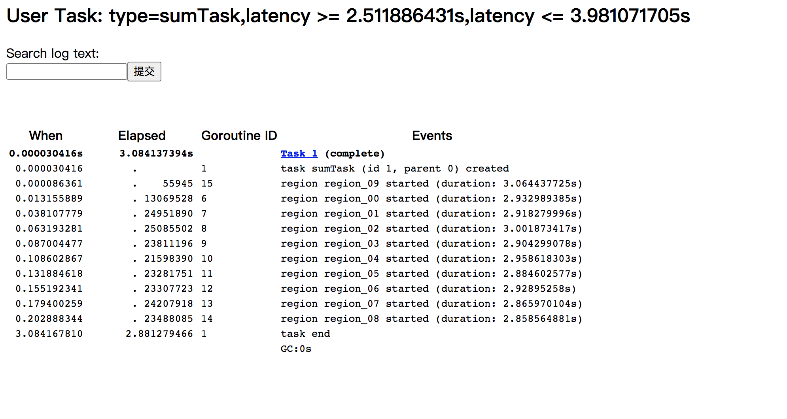

# 代码

```go
package main

import (
	"context"
	"fmt"
	"os"
	"runtime"
	"runtime/trace"
	"sync"
)

func main() {
	// 为了看协程抢占，这里设置了一个cpu 跑
	runtime.GOMAXPROCS(1)

	f, _ := os.Create("trace.dat")
	defer f.Close()

	_ = trace.Start(f)
	defer trace.Stop()

	ctx, task := trace.NewTask(context.Background(), "sumTask")
	defer task.End()

	var wg sync.WaitGroup
	wg.Add(10)
	for i := 0; i < 10; i++ {
		// 启动10个协程，只是做一个累加运算
		go func(region string) {
			defer wg.Done()

			// 标记region
			trace.WithRegion(ctx, region, func() {
				var sum, k int64
				for ; k < 1000000000; k++ {
					sum += k
				}
				fmt.Println(region, sum)
			})
		}(fmt.Sprintf("region_%02d", i))
	}
	wg.Wait()
}

```

启动10个协程，做sum运算

开启trace，将文件写入trace.dat

# 生成文件

trace.dat

```
go build trace_example.go
go tool trace trace.dat
```

```
go tool trace trace.dat
2020/12/23 18:38:57 Parsing trace...
2020/12/23 18:38:57 Splitting trace...
2020/12/23 18:38:57 Opening browser. Trace viewer is listening on http://127.0.0.1:54940
```


## 协程信息

```
http://127.0.0.1:57886/usertask?type=sumTask&complete=true&latmin=2.511886431s&latmax=3.981071705s
```





