[toc]

# 代码

```go
package main

import (
	"context"
	"fmt"
	"os"
	"runtime"
	"runtime/trace"
	"sync"
)

func main() {
	// 为了看协程抢占，这里设置了一个cpu 跑
	runtime.GOMAXPROCS(1)

	f, _ := os.Create("trace.dat")
	defer f.Close()

	_ = trace.Start(f)
	defer trace.Stop()

	ctx, task := trace.NewTask(context.Background(), "sumTask")
	defer task.End()

	var wg sync.WaitGroup
	wg.Add(10)
	for i := 0; i < 10; i++ {
		// 启动10个协程，只是做一个累加运算
		go func(region string) {
			defer wg.Done()

			// 标记region
			trace.WithRegion(ctx, region, func() {
				var sum, k int64
				for ; k < 1000000000; k++ {
					sum += k
				}
				fmt.Println(region, sum)
			})
		}(fmt.Sprintf("region_%02d", i))
	}
	wg.Wait()
}

```

启动10个协程，做sum运算

开启trace，将文件写入trace.dat

# 生成文件

trace.dat

```
go build trace_example.go
go tool trace trace.dat
```

```
go tool trace trace.dat
2020/12/23 18:38:57 Parsing trace...
2020/12/23 18:38:57 Splitting trace...
2020/12/23 18:38:57 Opening browser. Trace viewer is listening on http://127.0.0.1:54940
```

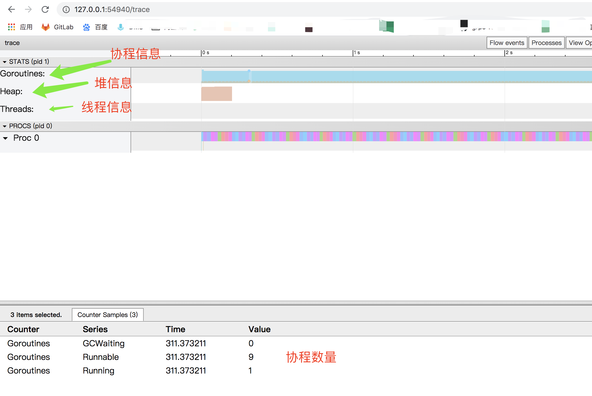

# 3、查看web

- View trace：查看跟踪
- Goroutine analysis：Goroutine 分析
- Network blocking profile：网络阻塞概况
- Synchronization blocking profile：同步阻塞概况
- Syscall blocking profile：系统调用阻塞概况
- Scheduler latency profile：调度延迟概况
- User defined tasks：用户自定义任务
- User defined regions：用户自定义区域
- Minimum mutator utilization：最低 Mutator 利用率

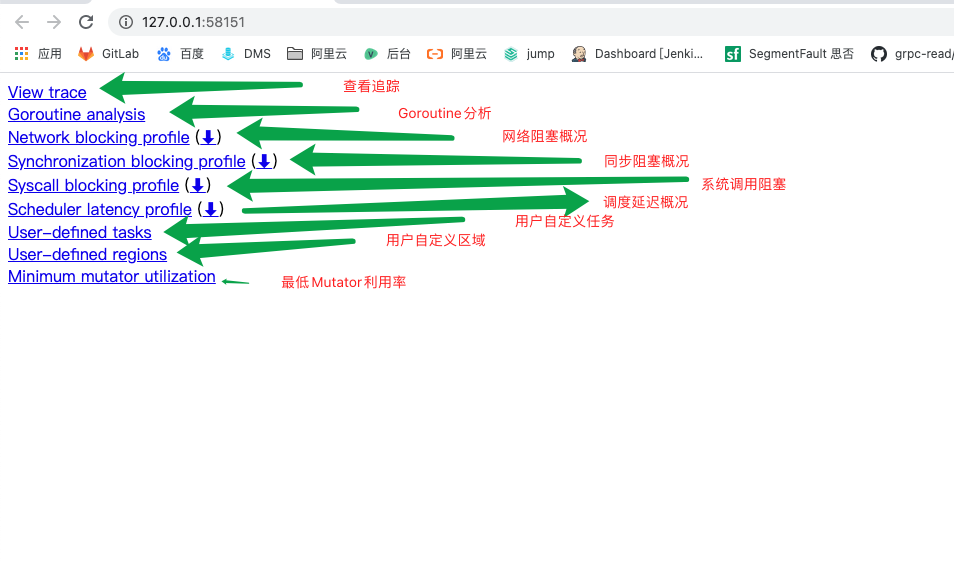


## 一、调度延迟情况

在刚开始查看问题时，除非是很明显的现象，否则不应该一开始就陷入细节，因此我们一般先查看 “Scheduler latency profile”，我们能通过 Graph 看到整体的调用开销情况，如下：

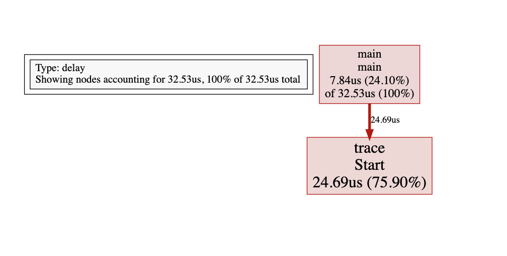


## 二、协程情况

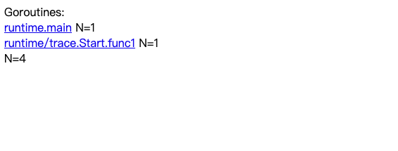

通过上图我们可以看到共有 3 个 goroutine，分别是 `runtime.main`、 `runtime/trace.Start.func1`、 `main.main.func1`，那么它都做了些什么事呢，接下来我们可以通过点击具体细项去观察。如下：


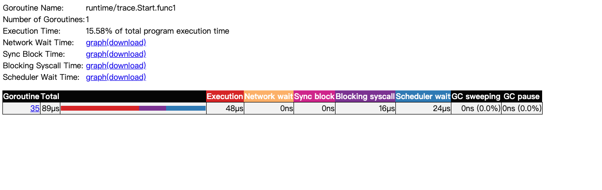


| Execution Time        | 执行时间     | 48ns |
| --------------------- | ------------ | ---- |
| Network Wait Time     | 网络等待时间 | 0ns  |
| Sync Block Time       | 同步阻塞时间 | 0ns  |
| Blocking Syscall Time | 调用阻塞时间 | 0ns  |
| Scheduler Wait Time   | 调度等待时间 | 14ns |
| GC Sweeping           | GC 清扫      | 0ns  |
| GC Pause              | GC 暂停      | 0ns  |


##  三、View trace

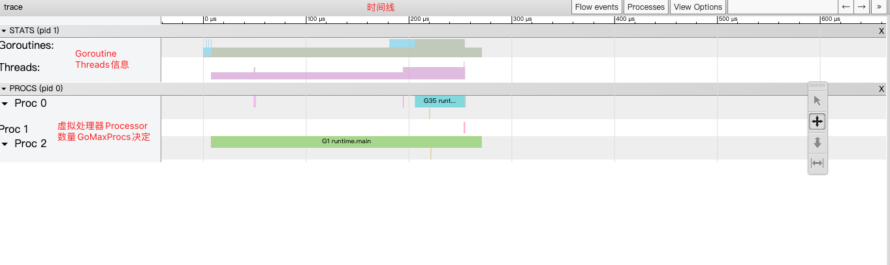

1. 时间线：显示执行的时间单元，根据时间维度的不同可以调整区间，具体可执行 shift + ? 查看帮助手册。
2. 堆：显示执行期间的内存分配和释放情况。
3. 协程：显示在执行期间的每个 Goroutine 运行阶段有多少个协程在运行，其包含 GC 等待（GCWaiting）、可运行（Runnable）、运行中（Running）这三种状态。
4. OS 线程：显示在执行期间有多少个线程在运行，其包含正在调用 Syscall（InSyscall）、运行中（Running）这两种状态。
5. 虚拟处理器：每个虚拟处理器显示一行，虚拟处理器的数量一般默认为系统内核数。
6. 协程和事件：显示在每个虚拟处理器上有什么 Goroutine 正在运行，而连线行为代表事件关联。


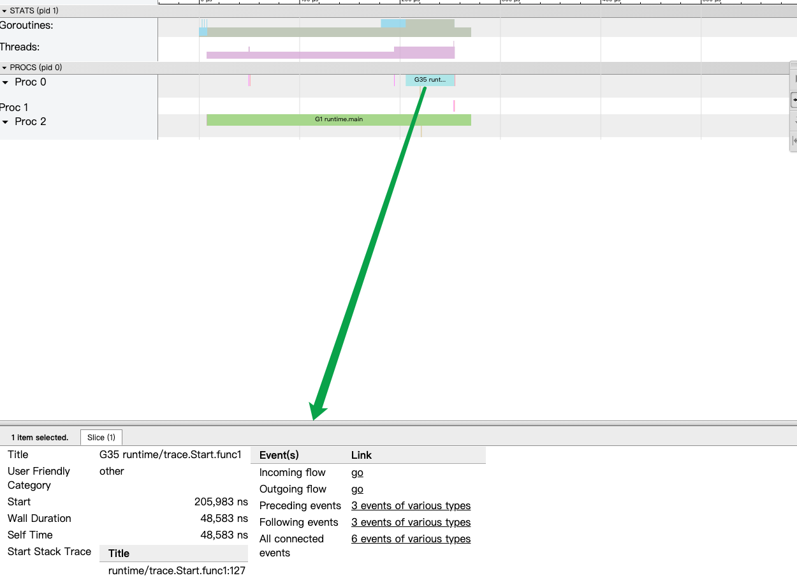

- Start：开始时间
- Wall Duration：持续时间
- Self Time：执行时间
- Start Stack Trace：开始时的堆栈信息
- End Stack Trace：结束时的堆栈信息
- Incoming flow：输入流
- Outgoing flow：输出流
- Preceding events：之前的事件
- Following events：之后的事件
- All connected：所有连接的事件

### View Events

我们可以通过点击 View Options-Flow events、Following events 等方式，查看我们应用运行中的事件流情况。如下：

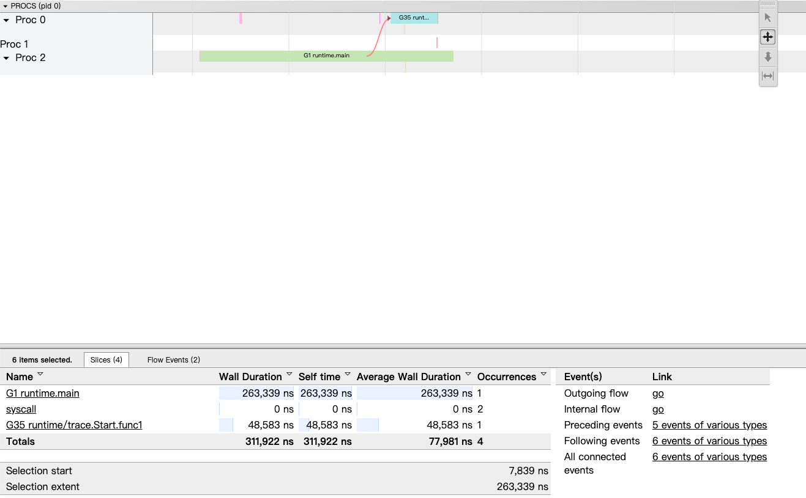

通过分析图上的事件流，我们可得知这程序从 `G1 runtime.main` 开始运行，在运行时创建了 2 个 Goroutine，先是创建 `G18 runtime/trace.Start.func1`，然后再是 `G19 main.main.func1` 。而同时我们可以通过其 Goroutine Name 去了解它的调用类型，如：`runtime/trace.Start.func1` 就是程序中在 `main.main` 调用了 `runtime/trace.Start` 方法，然后该方法又利用协程创建了一个闭包 `func1` 去进行调用。


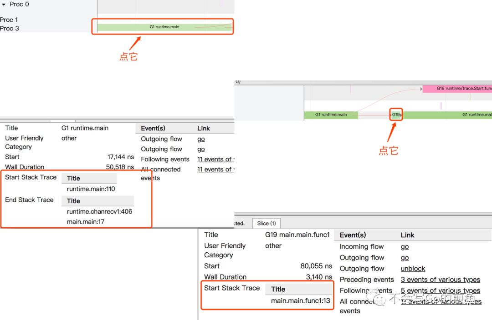

在这里我们结合开头的代码去看的话，很明显就是 ch 的输入输出的过程了。

# ==4、结合实战==

线上 

```
curl  http://10.xx1.xx3.80:4xx87/sxx/debug/pprof/trace\?seconeds\=10 > ./trace.data
```

得到

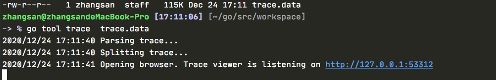

```
go tool trace trace.data
```


View trace

对着合适的区域执行快捷键 `W` 不断地放大时间线，如下：

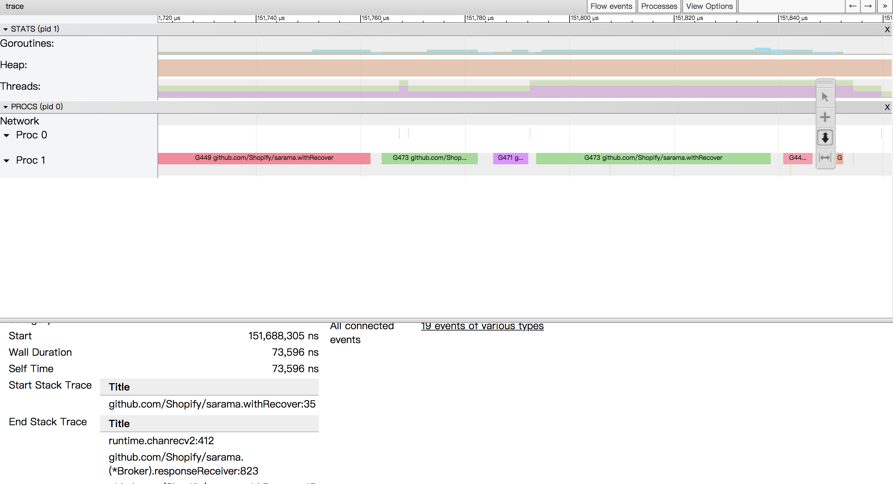

我们可以通过点击 View Options-Flow events、Following events 等方式，查看我们应用运行中的事件流情况。如下：

发现大部分都是和G7048 net/http.(*conn).serve 有关

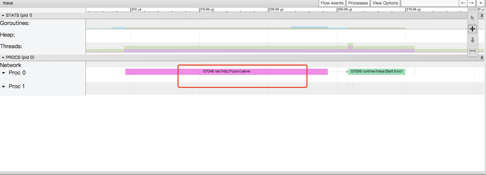

说明执行时间超过了sysmon的检测时间，协程在不停的进行切换和解除绑定和重新唤醒

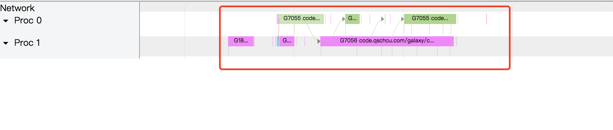


## Network blocking profile 和 Syscall blocking profile

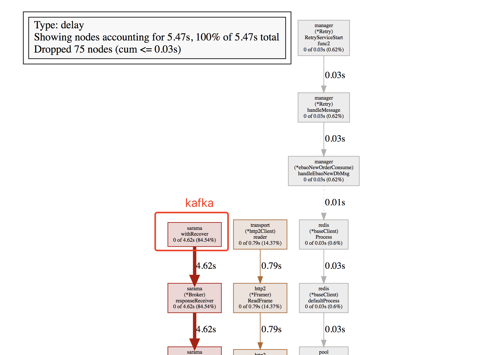


# 5、使用场景

## 诊断延迟问题

当完成关键任务的goroutine被阻止运行时，可能会引起延迟问题。 可能的原因有很多：做系统调用时被阻塞; 被共享内存阻塞（通道/互斥等）; 被runtime系统（例如GC）阻塞，甚至可能调度程序不像您想要的那样频繁地运行关键goroutine。

所有这些都可以使用go tool trace来识别。 您可以通过查看PROCs时间线来跟踪问题，并发现一段时间内goroutine被长时间阻塞。 一旦你确定了这段时间，应该给出一个关于根本原因的线索。

作为延迟问题的一个例子，让我们看看长时间的GC暂停：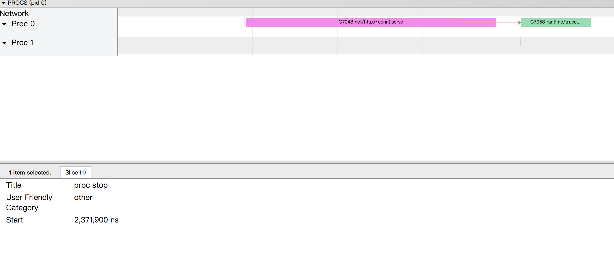

红色的事件代表了唯一的程序goroutine正在运行。 在所有四个线程上并行运行的goroutines是垃圾收集器的MARK阶段。 这个MARK阶段阻止了主要的goroutine。 你能出到阻止runtime.main goroutine的时间长短吗？

**在Go团队宣布GC暂停时间少于100微秒后**,我很快就调查了这个延迟问题。 我看到的漫长的停顿时间，`go tool trace`的结果看起来很奇怪，特别是可以看到它们(暂停)是在收集器的并发阶段发生的。 我在go-nuts 邮件列表中提到了这个问题，似乎与这个问题有关，现在已经在Go 1.8中修复了。 我的基准测试又出现了另一个GC暂停问题，这在写本文时依然会出现。 如果没有go tool trace这一工具，我是无法完成调查工作的。

## 诊断并行问题


通过本文我们习得了 go tool trace 的武林秘籍，它能够跟踪捕获各种执行中的事件，例如 Goroutine 的创建/阻塞/解除阻塞，Syscall 的进入/退出/阻止，GC 事件，Heap 的大小改变，Processor 启动/停止等等


