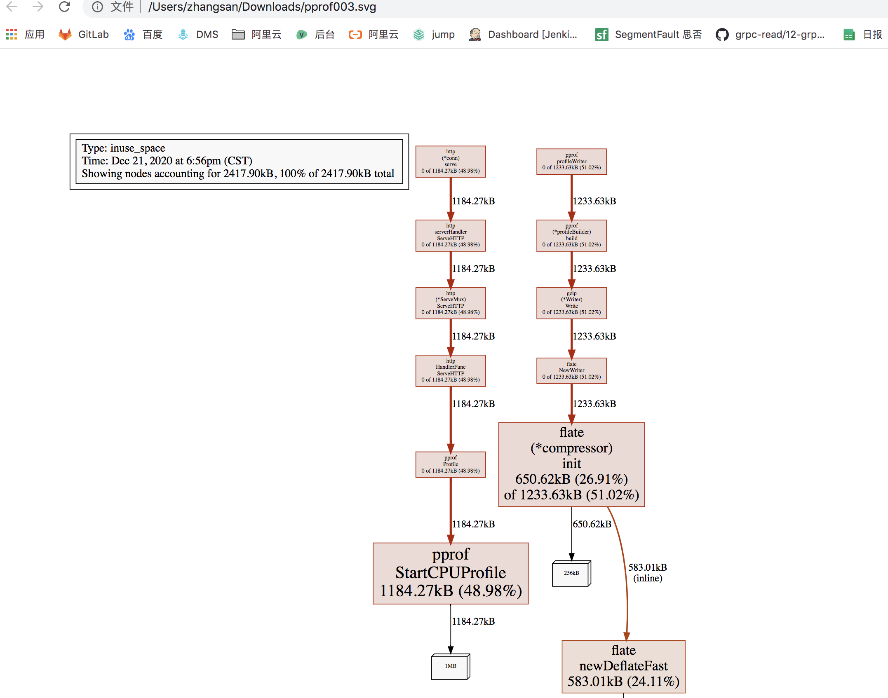
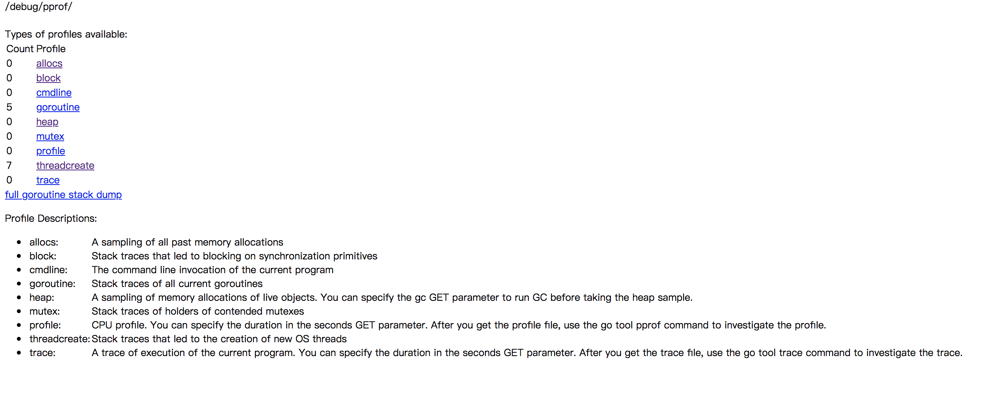
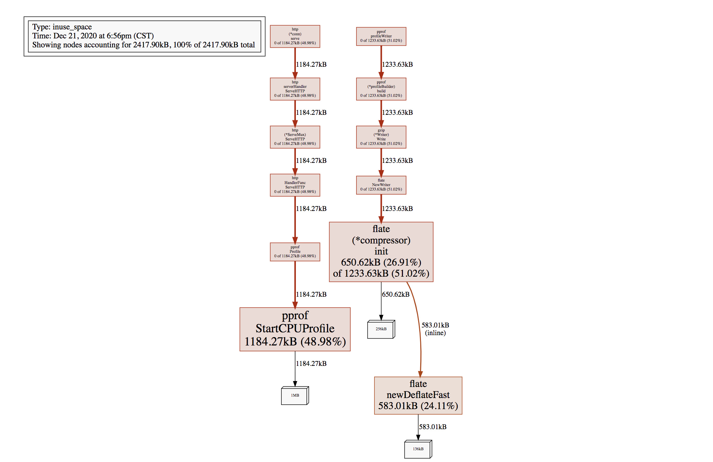
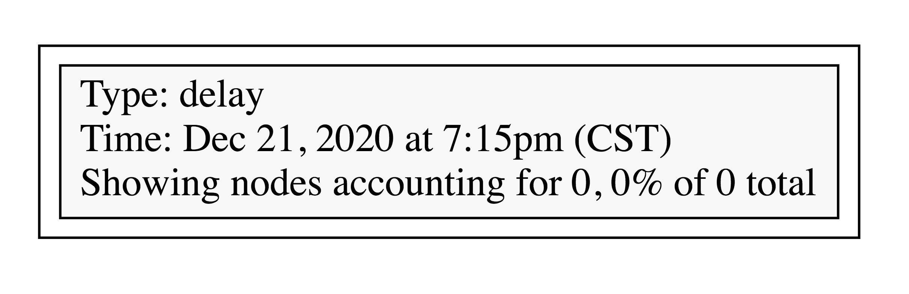
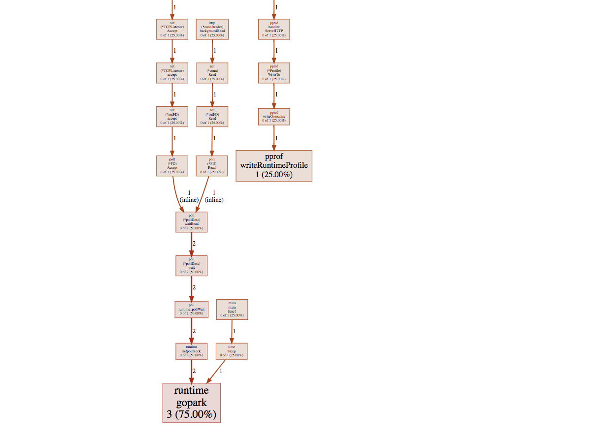

https://segmentfault.com/a/1190000016412013

https://segmentfault.com/a/1190000016354758  基准测试

# 通过交互式终端使用

（1）


# ==start==

# PProf

- runtime/pprof：采集程序（非 Server）的运行数据进行分析
- net/http/pprof：采集 HTTP Server 的运行时数据进行分析

# 支持什么使用模式

- Report generation：报告生成
- Interactive terminal use：交互式终端使用
- Web interface：Web 界面

# 可以做什么

- CPU Profiling：CPU 分析，按照一定的频率采集所监听的应用程序 CPU（含寄存器）的使用情况，可确定应用程序在主动消耗 CPU 周期时花费时间的位置
- Memory Profiling：内存分析，在应用程序进行堆分配时记录堆栈跟踪，用于监视当前和历史内存使用情况，以及检查内存泄漏
- Block Profiling：阻塞分析，记录 goroutine 阻塞等待同步（包括定时器通道）的位置
- Mutex Profiling：互斥锁分析，报告互斥锁的竞争情况


# 1、pprf 可视化

```go
go tool pprof http://localhost:6060/debug/pprof/profile\?seconds\=30
此时 输入web将文件保存下来 然后用浏览器打开
```




# demo

```
package main

import (
	"log"
	"net/http"
	_ "net/http/pprof"
	"time"
)

func main() {
	go func() {
		for {
			log.Println("https://github.com/EDDYCJY")
			time.Sleep(2 * time.Second)
		}
	}()

	http.ListenAndServe("0.0.0.0:6060", nil)
}

```

# 数据分析



远程访问

```
/debug/pprof/

Types of profiles available:
Count	Profile
2	allocs
0	block
0	cmdline
5	goroutine
2	heap
0	mutex
0	profile
8	threadcreate
0	trace
full goroutine stack dump
Profile Descriptions:

allocs: A sampling of all past memory allocations

block: Stack traces that led to blocking on synchronization primitives
cmdline: The command line invocation of the current program
goroutine: Stack traces of all current goroutines
heap: A sampling of memory allocations of live objects. You can specify the gc GET parameter to run GC before taking the heap sample.
mutex: Stack traces of holders of contended mutexes
profile: CPU profile. You can specify the duration in the seconds GET parameter. After you get the profile file, use the go tool pprof command to investigate the profile.
threadcreate: Stack traces that led to the creation of new OS threads
trace: A trace of execution of the current program. You can specify the duration in the seconds GET parameter. After you get the trace file, use the go tool trace command to investigate the trace.
```

# 2、交互式查看各种信息的地址

## 1、 cpu信息

```go
cpu（CPU Profiling）: `$HOST/debug/pprof/profile`，默认进行 30s 的 CPU Profiling，得到一个分析用的 profile 文件
http://127.0.0.1:6060/debug/pprof/profile


go tool pprof http://localhost:6060/debug/pprof/profile\?seconds\=60
```


```go
go tool pprof http://localhost:6060/debug/pprof/profile\?seconds\=30
Fetching profile over HTTP from http://localhost:6060/debug/pprof/profile?seconds=30
Saved profile in /Users/zhangsan/pprof/pprof.samples.cpu.001.pb.gz
Type: cpu
Time: Dec 21, 2020 at 6:47pm (CST)
Duration: 30s, Total samples = 0 
No samples were found with the default sample value type.
Try "sample_index" command to analyze different sample values.
Entering interactive mode (type "help" for commands, "o" for options)
(pprof) 
```

执行该命令后，需等待 30 秒（可调整 seconds 的值），pprof 会进行 CPU Profiling。结束后将默认进入 pprof 的交互式命令模式，可以对分析的结果进行查看或导出。具体可执行 `pprof help` 查看命令说明

### help 查看命令信息

```
callgrind        Outputs a graph in callgrind format
    comments         Output all profile comments
    disasm           Output assembly listings annotated with samples
    dot              Outputs a graph in DOT format
    eog              Visualize graph through eog
    evince           Visualize graph through evince
    gif              Outputs a graph image in GIF format
    gv               Visualize graph through gv
    kcachegrind      Visualize report in KCachegrind
    list             Output annotated source for functions matching regexp
    pdf              Outputs a graph in PDF format
    peek             Output callers/callees of functions matching regexp
    png              Outputs a graph image in PNG format
    proto            Outputs the profile in compressed protobuf format
    ps               Outputs a graph in PS format
    raw              Outputs a text representation of the raw profile
    svg              Outputs a graph in SVG format
    tags             Outputs all tags in the profile
    text             Outputs top entries in text form
    top              Outputs top entries in text form
    topproto         Outputs top entries in compressed protobuf format
    traces           Outputs all profile samples in text form
    tree             Outputs a text rendering of call graph
    web              Visualize graph through web browser
    weblist          Display annotated source in a web browser
    o/options        List options and their current values
    quit/exit/^D     Exit pprof

  Options:
    call_tree        Create a context-sensitive call tree
    compact_labels   Show minimal headers
    divide_by        Ratio to divide all samples before visualization
    drop_negative    Ignore negative differences
    edgefraction     Hide edges below <f>*total
    focus            Restricts to samples going through a node matching regexp
    hide             Skips nodes matching regexp
    ignore           Skips paths going through any nodes matching regexp
    mean             Average sample value over first value (count)
    nodecount        Max number of nodes to show
    nodefraction     Hide nodes below <f>*total
    noinlines        Ignore inlines.
    normalize        Scales profile based on the base profile.
    output           Output filename for file-based outputs
    prune_from       Drops any functions below the matched frame.
    relative_percentages Show percentages relative to focused subgraph
    sample_index     Sample value to report (0-based index or name)
    show             Only show nodes matching regexp
    show_from        Drops functions above the highest matched frame.
    source_path      Search path for source files
    tagfocus         Restricts to samples with tags in range or matched by regexp
    taghide          Skip tags matching this regexp
    tagignore        Discard samples with tags in range or matched by regexp
    tagshow          Only consider tags matching this regexp
    trim             Honor nodefraction/edgefraction/nodecount defaults
    trim_path        Path to trim from source paths before search
    unit             Measurement units to display

  Option groups (only set one per group):
    cumulative       
      cum              Sort entries based on cumulative weight
      flat             Sort entries based on own weight
    granularity      
      addresses        Aggregate at the address level.
      filefunctions    Aggregate at the function level.
      files            Aggregate at the file level.
      functions        Aggregate at the function level.
      lines            Aggregate at the source code line level.
  :   Clear focus/ignore/hide/tagfocus/tagignore

  type "help <cmd|option>" for more information

```

### top

输入 top 查看信息

```go
(pprof) top10
Showing nodes accounting for 25.92s, 97.63% of 26.55s total
Dropped 85 nodes (cum <= 0.13s)
Showing top 10 nodes out of 21
      flat  flat%   sum%        cum   cum%
    23.28s 87.68% 87.68%     23.29s 87.72%  syscall.Syscall
     0.77s  2.90% 90.58%      0.77s  2.90%  runtime.memmove
     0.58s  2.18% 92.77%      0.58s  2.18%  runtime.freedefer
     0.53s  2.00% 94.76%      1.42s  5.35%  runtime.scanobject
     0.36s  1.36% 96.12%      0.39s  1.47%  runtime.heapBitsForObject
     0.35s  1.32% 97.44%      0.45s  1.69%  runtime.greyobject
     0.02s 0.075% 97.51%     24.96s 94.01%  main.main.func1
     0.01s 0.038% 97.55%     23.91s 90.06%  os.(*File).Write
     0.01s 0.038% 97.59%      0.19s  0.72%  runtime.mallocgc
     0.01s 0.038% 97.63%     23.30s 87.76%  syscall.Write
```

- flat：给定函数上运行耗时
- flat%：同上的 CPU 运行耗时总比例
- sum%：给定函数累积使用 CPU 总比例
- cum：当前函数加上它之上的调用运行总耗时
- cum%：同上的 CPU 运行耗时总比例

## 2、heap堆信息

```go
go tool pprof http://localhost:6060/debug/pprof/heap

Fetching profile over HTTP from http://localhost:6060/debug/pprof/heap
Saved profile in /Users/zhangsan/pprof/pprof.alloc_objects.alloc_space.inuse_objects.inuse_space.004.pb.gz
Type: inuse_space
Time: Dec 21, 2020 at 6:56pm (CST)
Entering interactive mode (type "help" for commands, "o" for options)
(pprof) top
Showing nodes accounting for 2417.90kB, 100% of 2417.90kB total
Showing top 10 nodes out of 12
      flat  flat%   sum%        cum   cum%
 1184.27kB 48.98% 48.98%  1184.27kB 48.98%  runtime/pprof.StartCPUProfile
  650.62kB 26.91% 75.89%  1233.63kB 51.02%  compress/flate.(*compressor).init
  583.01kB 24.11%   100%   583.01kB 24.11%  compress/flate.newDeflateFast (inline)
         0     0%   100%  1233.63kB 51.02%  compress/flate.NewWriter
         0     0%   100%  1233.63kB 51.02%  compress/gzip.(*Writer).Write
         0     0%   100%  1184.27kB 48.98%  net/http.(*ServeMux).ServeHTTP
         0     0%   100%  1184.27kB 48.98%  net/http.(*conn).serve
         0     0%   100%  1184.27kB 48.98%  net/http.HandlerFunc.ServeHTTP
         0     0%   100%  1184.27kB 48.98%  net/http.serverHandler.ServeHTTP
         0     0%   100%  1184.27kB 48.98%  net/http/pprof.Profile
(pprof) 

```

- -inuse_space：分析应用程序的常驻内存占用情况
- -alloc_objects：分析应用程序的内存临时分配情况

### web查看

```
go tool pprof http://localhost:6060/debug/pprof/heap
输入web，然后保存文件
浏览器打开查看
```




<font color=red size=6x>**框越大，线越粗，占用资源越多**</font>


## 3、查看导致阻塞同步的堆栈跟踪

```go
block（Block Profiling）：`$HOST/debug/pprof/block`，查看导致阻塞同步的堆栈跟踪
```


```go
go tool pprof http://localhost:6060/debug/pprof/block
Fetching profile over HTTP from http://localhost:6060/debug/pprof/block
Saved profile in /Users/zhangsan/pprof/pprof.contentions.delay.001.pb.gz
Type: delay
Time: Dec 21, 2020 at 7:15pm (CST)
No samples were found with the default sample value type.
Try "sample_index" command to analyze different sample values.
Entering interactive mode (type "help" for commands, "o" for options)
(pprof) top
Showing nodes accounting for 0, 0% of 0 total
      flat  flat%   sum%        cum   cum%
(pprof) web
(pprof) web
(pprof) 

```

步骤：

top 是终端显示

```
go tool pprof http://localhost:6060/debug/pprof/block
输入web，然后保存文件
浏览器打开查看
```





## 4、 查看当前所有运行的 goroutines 堆栈跟踪

```go
go tool pprof http://localhost:6060/debug/pprof/goroutine
Fetching profile over HTTP from http://localhost:6060/debug/pprof/goroutine
Saved profile in /Users/zhangsan/pprof/pprof.goroutine.006.pb.gz
Type: goroutine
Time: Dec 21, 2020 at 7:41pm (CST)
Entering interactive mode (type "help" for commands, "o" for options)
(pprof) top
Showing nodes accounting for 4, 100% of 4 total
Showing top 10 nodes out of 29
      flat  flat%   sum%        cum   cum%
         3 75.00% 75.00%          3 75.00%  runtime.gopark
         1 25.00%   100%          1 25.00%  runtime/pprof.writeRuntimeProfile
         0     0%   100%          1 25.00%  internal/poll.(*FD).Accept
         0     0%   100%          1 25.00%  internal/poll.(*FD).Read
         0     0%   100%          2 50.00%  internal/poll.(*pollDesc).wait
         0     0%   100%          2 50.00%  internal/poll.(*pollDesc).waitRead (inline)
         0     0%   100%          2 50.00%  internal/poll.runtime_pollWait
         0     0%   100%          1 25.00%  main.main
         0     0%   100%          1 25.00%  main.main.func1
         0     0%   100%          1 25.00%  net.(*TCPListener).Accept
(pprof) 

```


```
go tool pprof http://localhost:6060/debug/pprof/goroutine
输入web，然后保存文件
浏览器打开查看
```





- 
- goroutine：`$HOST/debug/pprof/goroutine`，查看当前所有运行的 goroutines 堆栈跟踪
- heap（Memory Profiling）: `$HOST/debug/pprof/heap`，查看活动对象的内存分配情况
- mutex（Mutex Profiling）：`$HOST/debug/pprof/mutex`，查看导致互斥锁的竞争持有者的堆栈跟踪
- threadcreate：`$HOST/debug/pprof/threadcreate`，查看创建新OS线程的堆栈跟踪

Profile Descriptions:

- allocs:  分配:过去所有内存分配的抽样

  A sampling of all past memory allocations

  

- block:  块:导致同步原语阻塞的堆栈跟踪

  Stack traces that led to blocking on synchronization primitives

  

- cmdline:cmdline:当前程序的命令行调用

  The command line invocation of the current program

  

- goroutine: goroutine:所有当前goroutine的堆栈跟踪

  Stack traces of all current goroutines

  

- heap: 堆:活动对象的内存分配的抽样。您可以在获取堆样本之前指定gc GET参数来运行gc。

  A sampling of memory allocations of live objects. You can specify the gc GET parameter to run GC before taking the heap sample.

  

- mutex: 互斥锁:竞争互斥锁持有者的堆栈跟踪

  Stack traces of holders of contended mutexes

  

- profile: 简介:CPU配置文件。您可以在seconds GET参数中指定持续时间。在您获得这个概要文件之后，使用go工具pprof命令来研究这个概要文件。

  CPU profile. You can specify the duration in the seconds GET parameter. After you get the profile file, use the go tool pprof command to investigate the profile.

  

- threadcreate: threadcreate:导致创建新OS线程的堆栈跟踪

  Stack traces that led to the creation of new OS threads

  

- trace: 跟踪:当前程序执行的跟踪。您可以在seconds GET参数中指定持续时间。在您获得跟踪文件之后，使用go工具跟踪命令来调查跟踪。 

  A trace of execution of the current program. You can specify the duration in the seconds GET parameter. After you get the trace file, use the go tool trace command to investigate the trace.

- 


