https://segmentfault.com/a/1190000016412013

https://segmentfault.com/a/1190000016354758  基准测试

[toc]


# 分析准备工具

```
brew install graphviz
```

# go tool pprof参数分析

- <font color=red size=5x>**-inuse_space           正在使用的内存**</font>
- <font color=green size=5x>**-inuse_objects         正在使用的分配的的对象**</font>
- <font color=red size=5x>** -alloc_space 从程序开始到现在总共分配的内存**</font>
- <font color=green size=5x>** -alloc_objects 从程序开始到现在总共分配的对象**</font>
-   <font color=red size=5x>**-total_delay **</font>
- <font color=green size=5x>**-contentions **</font>
- <font color=red size=5x>**-mean_delay **</font>

## 1、当前占用内存inuse_space

### 终端查看

```
go tool pprof   -inuse_space   http://1x.1xx.1x3.xx:4803/debug/pprof/heap
```


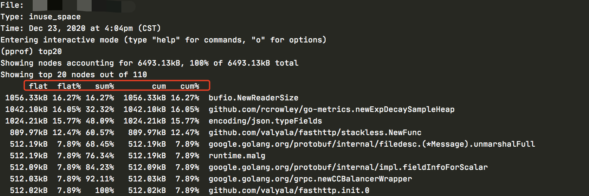

- <font color=green size=5x>**flat：给定函数上运行耗时**</font>
- <font color=red size=5x>**flat%：同上的 CPU 运行耗时总比例**</font>
- <font color=green size=5x>**sum%：给定函数累积使用 CPU 总比例**</font>
- <font color=red size=5x>**cum：当前函数加上它之上的调用运行总耗时**</font>
- <font color=green size=5x>**cum%：同上的 CPU 运行耗时总比例**</font>
- <font color=red size=5x>**最后一列为函数名称，在大多数的情况下，我们可以通过这五列得出一个应用程序的运行情况，加以优化**</font>
- 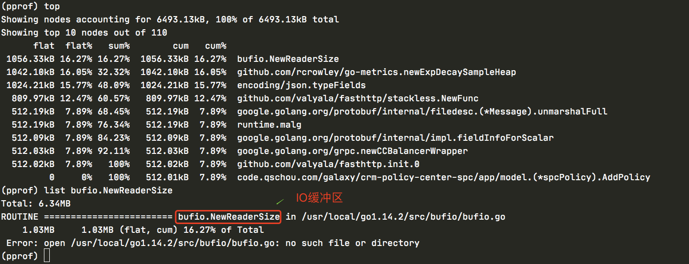

### web查看

```
go tool pprof -http=127.0.0.1:12345  -inuse_space   http://1x.1xx.1x3.xx:4803/debug/pprof/heap
```

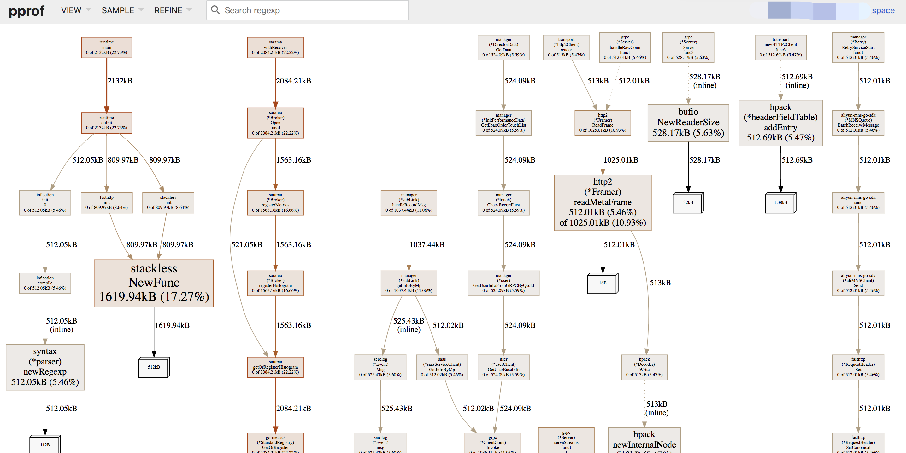


## 2、当前分配对象数量 inuse_objects

### 终端查看

```
go tool pprof   -inuse_objects   http://1x.1xx.1xx.x0:487/sxx/debug/pprof/heap
```


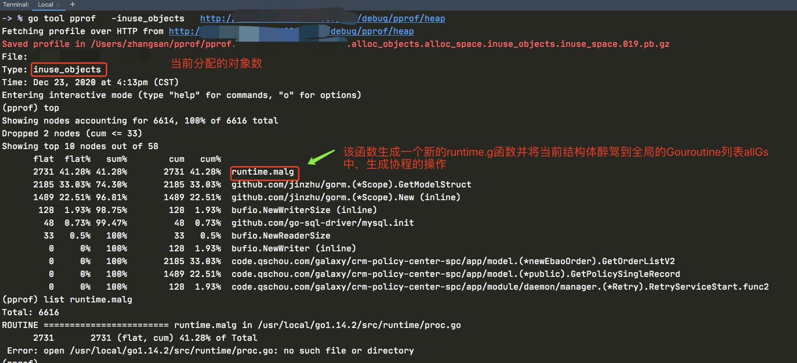


### web查看

```
go tool pprof   -http=127.0.0.1:12345 -inuse_objects   http://1x.1xx.1xx.x0:487/sxx/debug/pprof/heap
```


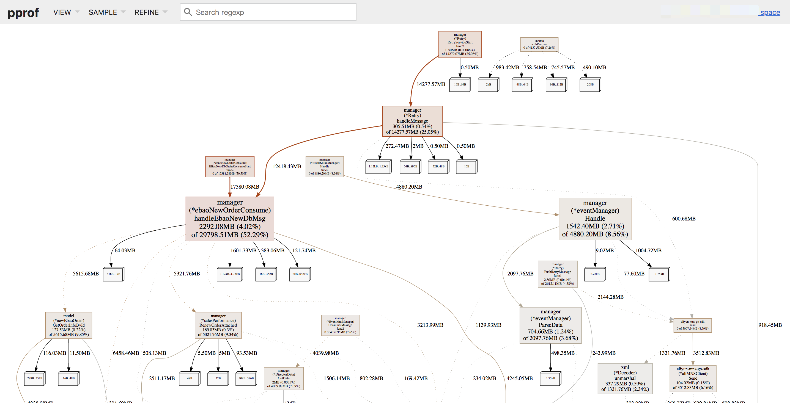

## 3、程序启动到现在的内存使用 alloc_space

### 终端查看

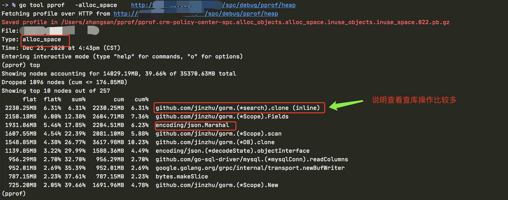

- <font color=green size=5x>**flat：给定函数上运行耗时**</font>
- <font color=red size=5x>**flat%：同上的 CPU 运行耗时总比例**</font>
- <font color=green size=5x>**sum%：给定函数累积使用 CPU 总比例**</font>
- <font color=red size=5x>**cum：当前函数加上它之上的调用运行总耗时**</font>
- <font color=green size=5x>**cum%：同上的 CPU 运行耗时总比例**</font>
- <font color=red size=5x>**最后一列为函数名称，在大多数的情况下，我们可以通过这五列得出一个应用程序的运行情况，加以优化**</font>

### web 查看

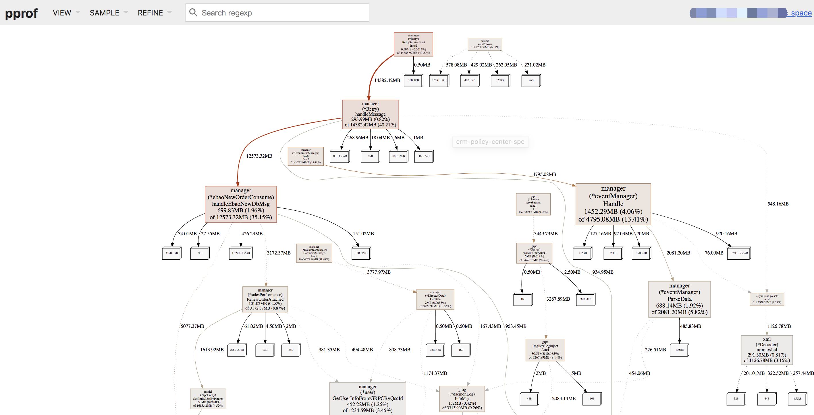

## 4、从启动到现在的总分配对象 alloc_objects

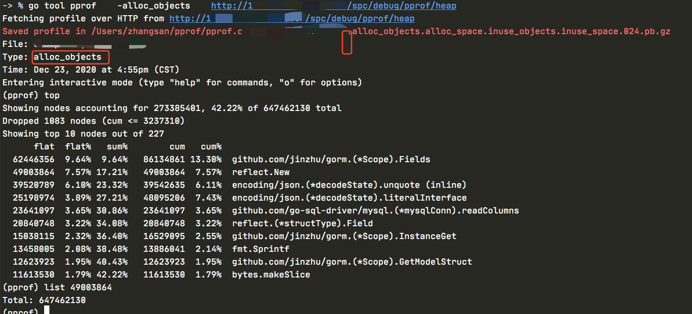

- <font color=green size=5x>**flat：给定函数上运行耗时**</font>
- <font color=red size=5x>**flat%：同上的 CPU 运行耗时总比例**</font>
- <font color=green size=5x>**sum%：给定函数累积使用 CPU 总比例**</font>
- <font color=red size=5x>**cum：当前函数加上它之上的调用运行总耗时**</font>
- <font color=green size=5x>**cum%：同上的 CPU 运行耗时总比例**</font>
- <font color=red size=5x>**最后一列为函数名称，在大多数的情况下，我们可以通过这五列得出一个应用程序的运行情况，加以优化**</font>


# 1、PProf

- runtime/pprof：采集程序（非 Server）的运行数据进行分析
- net/http/pprof：采集 HTTP Server 的运行时数据进行分析

# 2、支持什么使用模式

- Report generation：报告生成
- Interactive terminal use：交互式终端使用
- Web interface：Web 界面

# 3、可以做什么

- CPU Profiling：CPU 分析，按照一定的频率采集所监听的应用程序 CPU（含寄存器）的使用情况，可确定应用程序在主动消耗 CPU 周期时花费时间的位置
- Memory Profiling：内存分析，在应用程序进行堆分配时记录堆栈跟踪，用于监视当前和历史内存使用情况，以及检查内存泄漏
- Block Profiling：阻塞分析，记录 goroutine 阻塞等待同步（包括定时器通道）的位置
- Mutex Profiling：互斥锁分析，报告互斥锁的竞争情况


# 4、 测试demo

```
% tree       
.
├── data
│   └── d.go
├── go.mod
└── main.go

1 directory, 3 files
```

Main.go

```
package main

import (
	"log"
	"net/http"
	_ "net/http/pprof"
	"pproftest/data"
	"time"
)

func main() {
	go func() {
		for {
			time.Sleep(1*time.Second)
			log.Println(data.Add("https://github.com/EDDYCJY"))
		}
	}()

	http.ListenAndServe("0.0.0.0:6060", nil)
}

```

d.go

```
package data

var datas []string

func Add(str string) string {
	data := []byte(str)
	sData := string(data)
	datas = append(datas, sData)

	return sData
}

```

<font color=red size=5x>**启动程序**</font>

```
go run main.go
```

<font color=red size=5x>**实际应用**</font>

```
package main

import (
	"fmt"
	"net/http"
	_ "net/http/pprof" // 第一步～
)

// 一段有问题的代码
func do() {
	var c chan int
	for {
		select {
		case v := <-c:
			fmt.Printf("我是有问题的那一行，因为收不到值：%v", v)
		default:
		}
	}
}

func main() {
	// 执行一段有问题的代码
	for i := 0; i < 4; i++ {
		go do()
	}
	http.ListenAndServe("0.0.0.0:6061", nil)
}

```


# 5、 访问web

```
http://127.0.0.1:6060/debug/pprof/
```

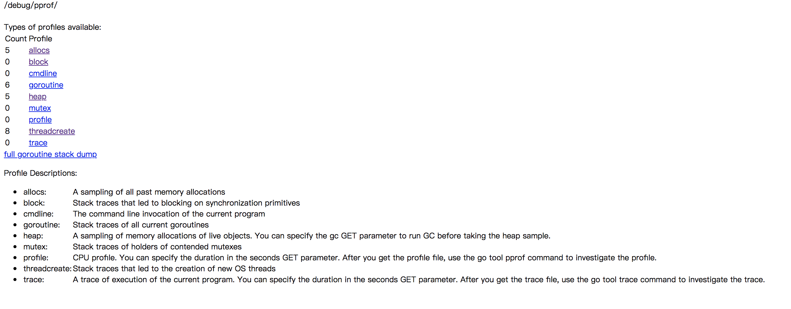

<font color=red size=5x>**描述**</font>

| 类型         | 描述                                      |
| :----------- | :---------------------------------------- |
| allocs       | **内**存分配情况的采样信息                |
| blocks       | **阻塞**操作情况的采样信息                |
| cmdline      | 显示程序启动**命令参数**及其参数          |
| goroutine    | 显示当前所有**协程**的堆栈信息            |
| heap         | **堆**上的内存分配情况的采样信息          |
| mutex        | **锁**竞争情况的采样信息                  |
| profile      | **cpu**占用情况的采样信息，点击会下载文件 |
| threadcreate | 系统**线程**创建情况的采样信息            |
| trace        | 程序**运行跟踪**信息                      |


# 6、指标解析

## 1、runtime.futex

CPU的指标，通常这个和锁有关系

一般情况是GC的时候进行的STW的开启锁定锁导致

## 2、 runtime.gopark--协程指标

gopark函数在协程的实现上扮演着非常重要的角色，用于协程的切换，协程切换的原因一般有以下几种情况：

1. 系统调用或者网络调用；
2. channel读写条件不满足；
3. 抢占式调度时间片结束；

### gopark函数做的主要事情分为两点：

1. 解除当前goroutine的m的绑定关系，将当前goroutine状态机切换为等待状态；
2. 调用一次schedule()函数，在局部调度器P发起一轮新的调度。

### 调用过程

```go
func gopark(unlockf func(*g, unsafe.Pointer) bool, lock unsafe.Pointer, reason waitReason, traceEv byte, traceskip int) {
	if reason != waitReasonSleep {
		checkTimeouts() // timeouts may expire while two goroutines keep the scheduler busy
	}
	mp := acquirem()
	gp := mp.curg
	status := readgstatus(gp)
	if status != _Grunning && status != _Gscanrunning {
		throw("gopark: bad g status")
	}
	mp.waitlock = lock
	mp.waitunlockf = *(*unsafe.Pointer)(unsafe.Pointer(&unlockf))
	gp.waitreason = reason
	mp.waittraceev = traceEv
	mp.waittraceskip = traceskip
	releasem(mp)
	// can't do anything that might move the G between Ms here.
	mcall(park_m)
}

```

源码里面最重要的一行就是调用 `mcall(park_m)` 函数，park_m是一个函数指针。mcall在golang需要进行协程切换时被调用，做的主要工作是：

1. 切换当前线程的堆栈从g的堆栈切换到g0的堆栈；
2. 并在g0的堆栈上执行新的函数fn(g)；
3. 保存当前协程的信息( PC/SP存储到g->sched)，当后续对当前协程调用goready函数时候能够恢复现场；

## 3、runtime.ready  唤起协程

```go
func goready(gp *g, traceskip int) {
	// 切换到g0的栈
	systemstack(func() {
		ready(gp, traceskip, true)
	})
}

```

goready函数相比gopark函数来说简单一些，主要功能就是唤醒某一个goroutine，该协程转换到runnable的状态，并将其放入P的local queue，等待调度。

## 4、runtime·notetslee 栈增长及执行时间检测

```
same as runtime·notetsleep, but called on user g (not g0)
// calls only nosplit functions between entersyscallblock/exitsyscall
```

检测栈增长及监控G的执行时间是否超过10ms，如果超过将当前G和M绑定，解绑P


# 7、进入中端

## 一 、查看CPU信息

```
cpu（CPU Profiling）: $HOST/debug/pprof/profile，默认进行 30s 的 CPU Profiling，得到一个分析用的 profile 文件
```


另外启动中端，等待30s

```
go tool pprof http://localhost:6060/debug/pprof/profile\?seconds\=60
```

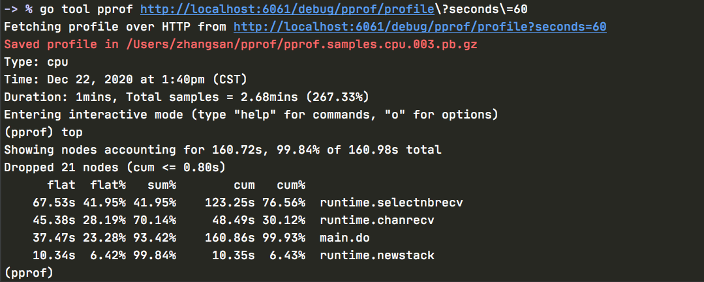


| 类型     | 描述                                            | 举例                                                         |
| :------- | :---------------------------------------------- | :----------------------------------------------------------- |
| flat     | 该函数占用CPU的耗时                             | selectnbrecv占用CPU的耗时是12.29s                            |
| flat%    | 该函数占用CPU的耗时的百分比                     | selectnbrecv耗时：12.29s，cpu总耗时：29.14，12.29/29.14=42.18 |
| sum%     | top命令中排在它上面的函数以及本函数flat%之和    | chanrecv：42.18%+30.47% = 72.65%                             |
| cum      | 当前函数加上该函数调用之前的累计CPU耗时         | chanrecv：8.88+0.54=9.42                                     |
| cum%     | 当前函数加上该函数调用之前的累计CPU耗时的百分比 | 9.42/29.14=32.33%                                            |
| 最后一列 | 当前函数名称                                    | -                                                            |

### ==<font color=red size=5x>查看内存分配取样</font>==

默认情况下取样时只取当前内存使用情况，可以加可选命令alloc_objects，将从程序开始时的内存取样

```
go tool pprof -alloc_objects -http=127.0.0.1:12345  http://xxx:9999/debug/pprof/heap
```


### ==查看某个函数的细节==

```
终端模式下输入
list 加函数名
```


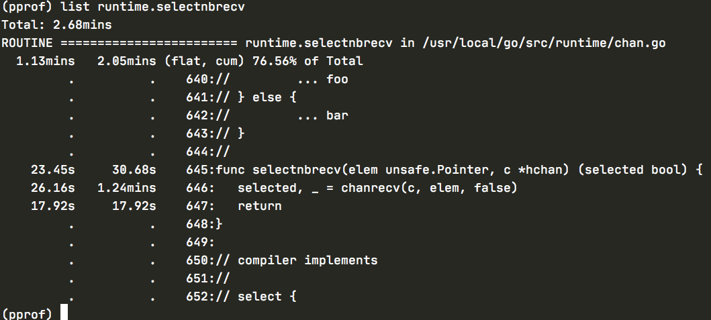

- <font color=green size=5x>**flat：给定函数上运行耗时**</font>
- <font color=red size=5x>**flat%：同上的 CPU 运行耗时总比例**</font>
- <font color=green size=5x>**sum%：给定函数累积使用 CPU 总比例**</font>
- <font color=red size=5x>**cum：当前函数加上它之上的调用运行总耗时**</font>
- <font color=green size=5x>**cum%：同上的 CPU 运行耗时总比例**</font>
- <font color=red size=5x>**最后一列为函数名称，在大多数的情况下，我们可以通过这五列得出一个应用程序的运行情况，加以优化**</font>

### web

```
go tool pprof -http=127.0.0.1:1234  http://localhost:6061/debug/pprof/profile\?seconds\=10
```


<font color=green size=5x>**线越粗越有问题，耗时越高**</font>

```
终端模式下
web png 或者pdf
```

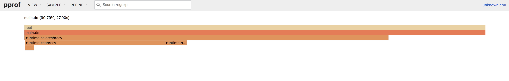

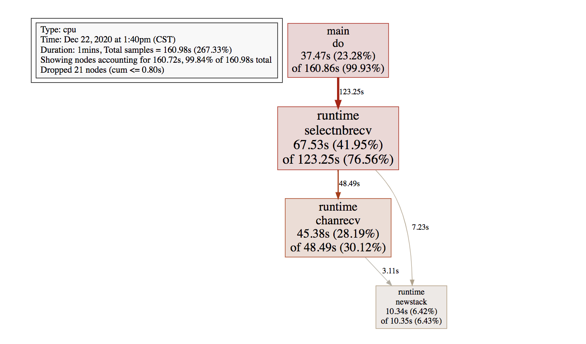

<font color=red size=5x>**查看do函数**</font>

```
list  main.do
```

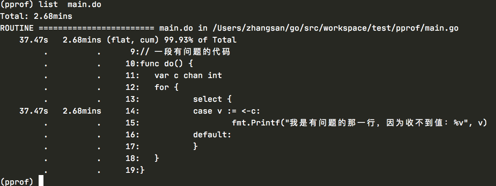

<font color=red size=5x>发现有问题的行数在文中具体的位置，原来是卡住了，加上default休眠n秒即可解决。</font>


## 二、查看阻塞堆栈信息

```
block（Block Profiling）：$HOST/debug/pprof/block，查看导致阻塞同步的堆栈跟踪
```


```
go tool pprof http://localhost:6061/debug/pprof/block\?seconds\=10
```

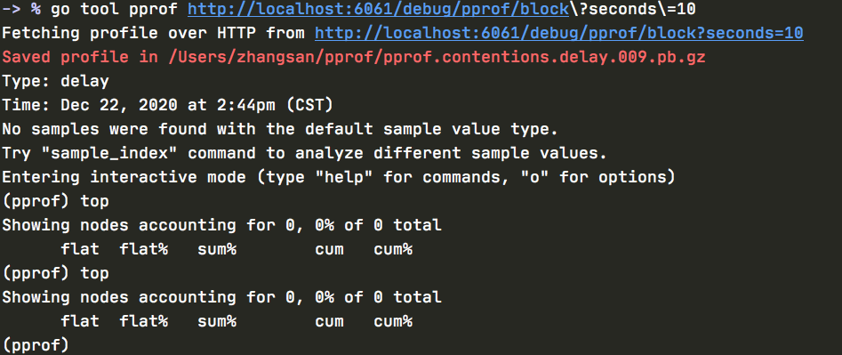

- <font color=green size=5x>**flat：给定函数上运行耗时**</font>
- <font color=red size=5x>**flat%：同上的 CPU 运行耗时总比例**</font>
- <font color=green size=5x>**sum%：给定函数累积使用 CPU 总比例**</font>
- <font color=red size=5x>**cum：当前函数加上它之上的调用运行总耗时**</font>
- <font color=green size=5x>**cum%：同上的 CPU 运行耗时总比例**</font>
- <font color=red size=5x>**最后一列为函数名称，在大多数的情况下，我们可以通过这五列得出一个应用程序的运行情况，加以优化**</font>

### ==查看某个函数细节==

和上边CPu的一样list

### web

Web 也是一样


## 三、查看协程堆栈信息

```
goroutine：$HOST/debug/pprof/goroutine，查看当前所有运行的 goroutines 堆栈跟踪
```


```
go tool pprof http://localhost:6061/debug/pprof/goroutine\?seconds\=10
```

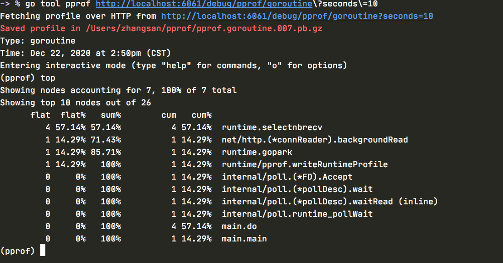

- <font color=green size=5x>**flat：给定函数上运行耗时**</font>
- <font color=red size=5x>**flat%：同上的 CPU 运行耗时总比例**</font>
- <font color=green size=5x>**sum%：给定函数累积使用 CPU 总比例**</font>
- <font color=red size=5x>**cum：当前函数加上它之上的调用运行总耗时**</font>
- <font color=green size=5x>**cum%：同上的 CPU 运行耗时总比例**</font>
- <font color=red size=5x>**最后一列为函数名称，在大多数的情况下，我们可以通过这五列得出一个应用程序的运行情况，加以优化**</font>

### ==查看某个函数细节==

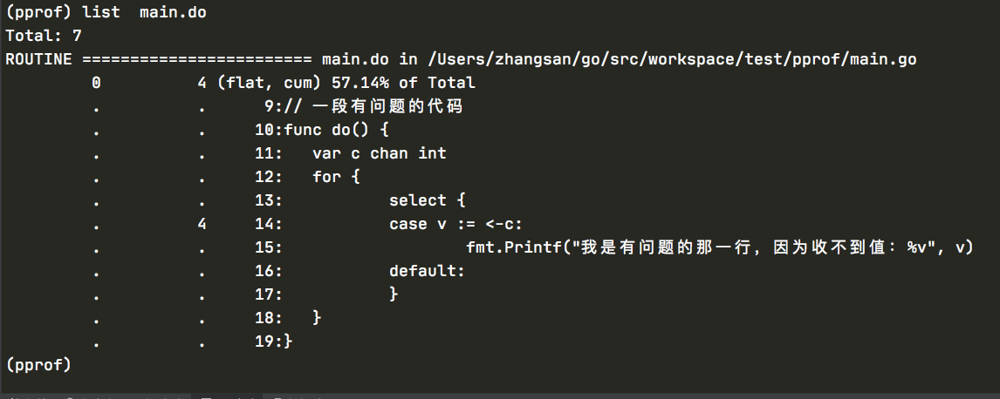

- flat：给定函数上运行耗时
- flat%：同上的 CPU 运行耗时总比例
- sum%：给定函数累积使用 CPU 总比例
- cum：当前函数加上它之上的调用运行总耗时
- cum%：同上的 CPU 运行耗时总比例

### web查看

```
go tool pprof -http=127.0.0.1:1345  http://localhost:6061/debug/pprof/goroutine
```

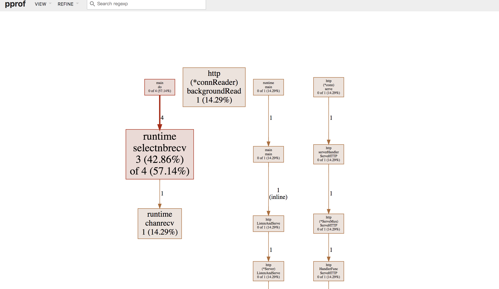


## 四、查看内存分配情况

- <font color=green size=5x>**-inuse_space：分析应用程序的常驻内存占用情况**</font>
- <font color=green size=5x>-alloc_objects：**分析应用程序的内存临时分配情况**</font>

```
heap（Memory Profiling）: $HOST/debug/pprof/heap，查看活动对象的内存分配情况
```


```
go tool pprof  http://localhost:6061/debug/pprof/heap
```

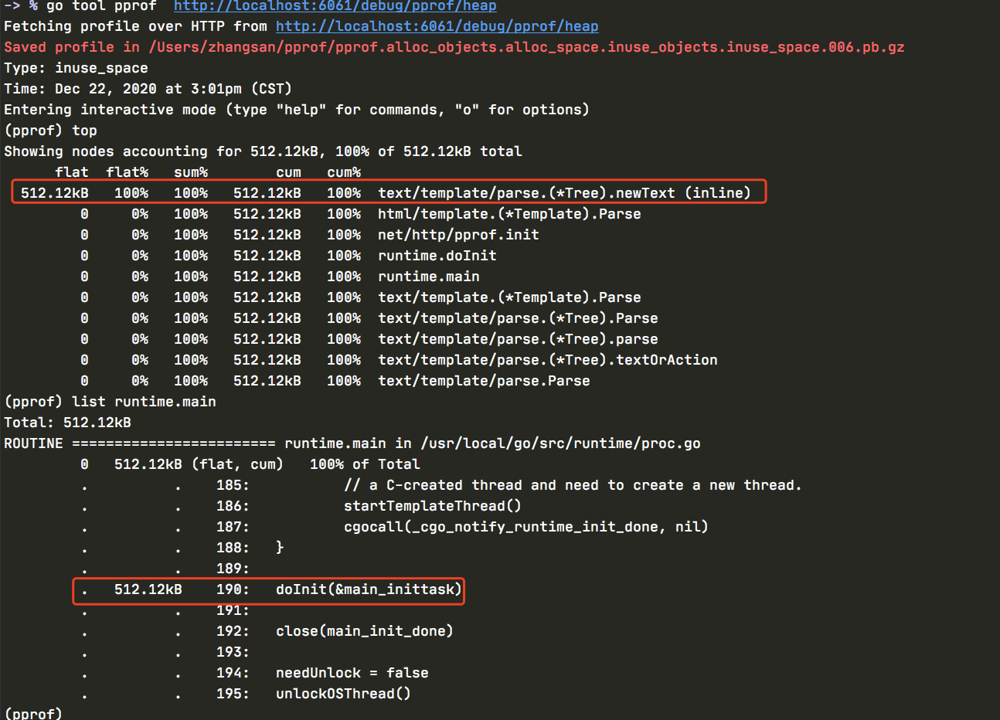

- <font color=green size=5x>**flat：给定函数上运行耗时**</font>
- <font color=red size=5x>**flat%：同上的 CPU 运行耗时总比例**</font>
- <font color=green size=5x>**sum%：给定函数累积使用 CPU 总比例**</font>
- <font color=red size=5x>**cum：当前函数加上它之上的调用运行总耗时**</font>
- <font color=green size=5x>**cum%：同上的 CPU 运行耗时总比例**</font>
- <font color=red size=5x>**最后一列为函数名称，在大多数的情况下，我们可以通过这五列得出一个应用程序的运行情况，加以优化**</font>

### ==web查看==

```
go tool pprof -http=127.0.0.1:1345  http://localhost:6061/debug/pprof/heap
```


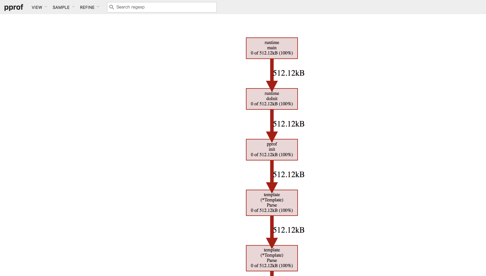

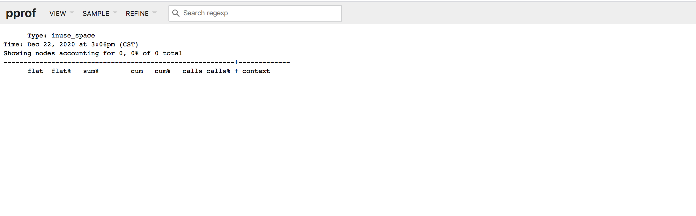

## 五、查看互斥锁信息

```
mutex（Mutex Profiling）：$HOST/debug/pprof/mutex，查看导致互斥锁的竞争持有者的堆栈跟踪
```


```
go tool pprof   http://localhost:6061/debug/pprof/mutex
```

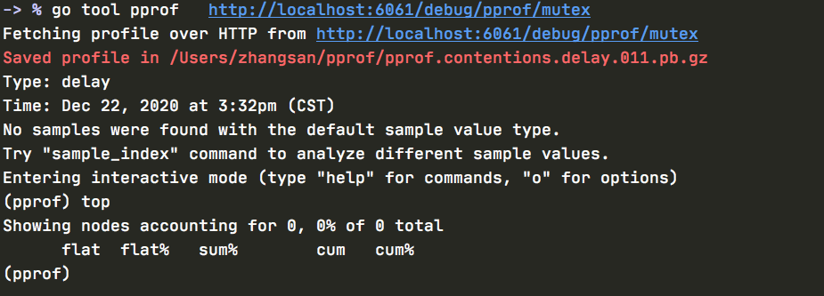


### ==查看某个函数细节==

同上

### web查看

```
go tool pprof -http=127.0.0.1:1345  http://localhost:6061/debug/pprof/mutex
```

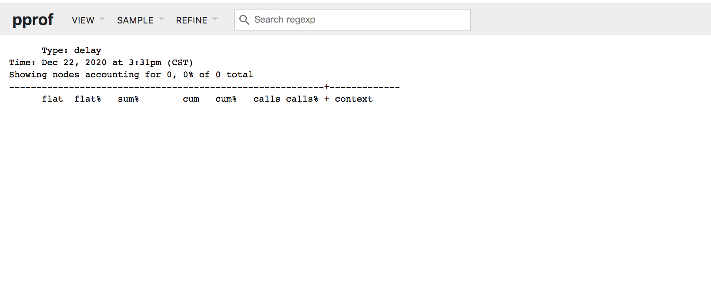


## 六、查看创建新OS线程的堆栈跟踪

```
threadcreate：$HOST/debug/pprof/threadcreate，查看创建新OS线程的堆栈跟踪
```


```
go tool pprof   http://localhost:6061/debug/pprof/threadcreate
```

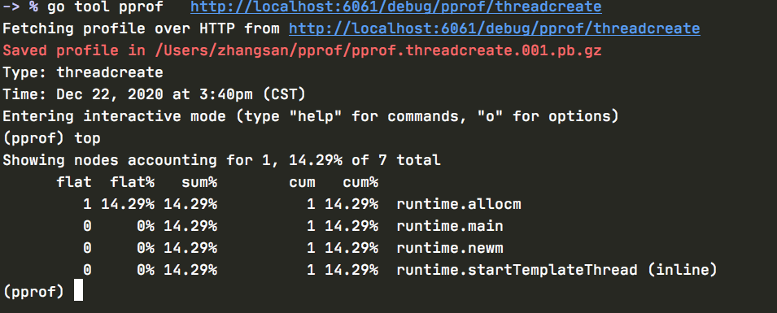

- <font color=green size=5x>**flat：给定函数上运行耗时**</font>
- <font color=red size=5x>**flat%：同上的 CPU 运行耗时总比例**</font>
- <font color=green size=5x>**sum%：给定函数累积使用 CPU 总比例**</font>
- <font color=red size=5x>**cum：当前函数加上它之上的调用运行总耗时**</font>
- <font color=green size=5x>**cum%：同上的 CPU 运行耗时总比例**</font>
- <font color=red size=5x>**最后一列为函数名称，在大多数的情况下，我们可以通过这五列得出一个应用程序的运行情况，加以优化**</font>


### ==查看某个函数细节==

```
list runtime.main
```

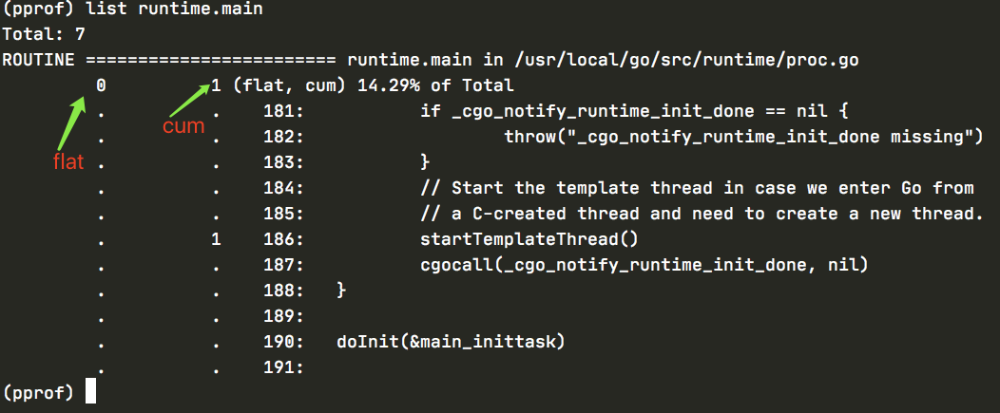

### web

```
go tool pprof -http=127.0.0.1:1345   http://localhost:6061/debug/pprof/threadcreate
```

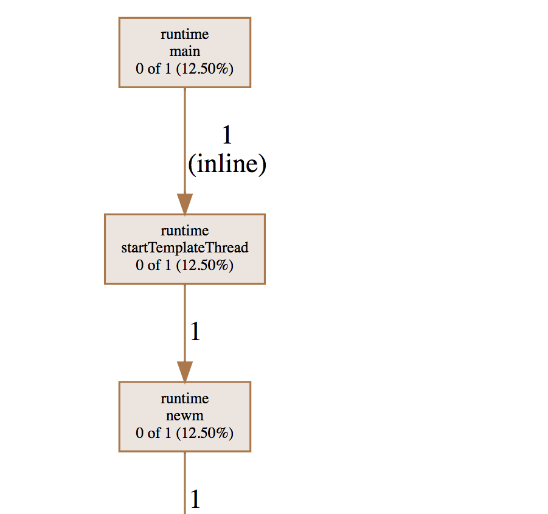

# 8、 PProf 火焰图

<font color=red size=5x>**每一块代表一个函数，越大代表占用 CPU 的时间更长**</font>

另一种可视化数据的方法是火焰图，需手动安装原生 PProf 工具：

（1） 安装 PProf

```
$ go get -u github.com/google/pprof
```

（2） 启动 PProf 可视化界面:

```
$ pprof -http=:8080 cpu.prof
```

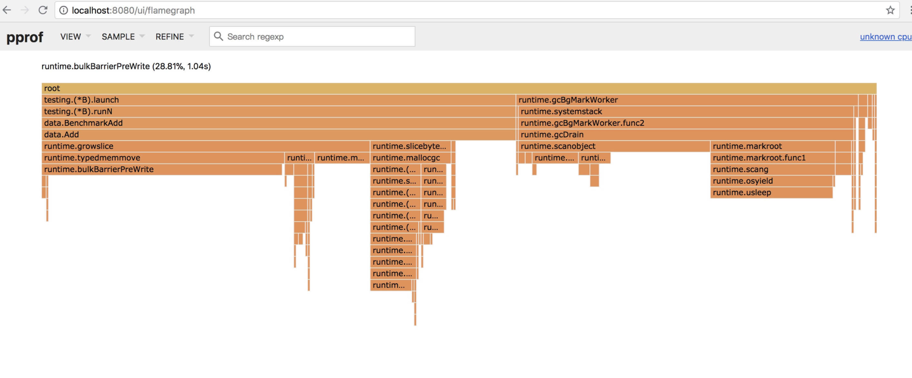

# 9、PProf 编程

## 终端文件分析

代码

```
package main

import (
	"fmt"
	"log"
	"os"
	"runtime/pprof"
	"time"
)

func do() {
	var c chan int
	for {
		select {
		case v := <-c:
			fmt.Println("有问题", v)
		default:
			fmt.Println("default")
		}

	}
}

func main() {
	var (
		file *os.File
		err  error
	)

	if file, err = os.Create("./cpu.prof"); nil != err {
		log.Fatal(err)
	}

	//1、获取CPU信息
	if err = pprof.StartCPUProfile(file); err != nil {
		log.Fatal(err)
	}
	defer pprof.StopCPUProfile()

	for i := 0; i < 4; i++ {
		go do()
	}
	time.Sleep(10 * time.Second)
}

```

生成

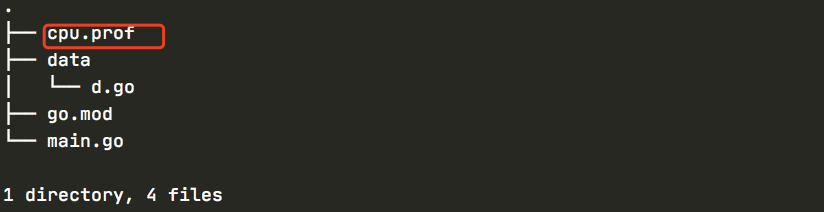

### ==分析文件和前边一样==

```
go tool pprof <binary> <source>

binary：代表二进制文件路径。

source：代表生成的分析数据来源，可以是本地文件（前文生成的cpu.prof），也可以是http地址（比如：go tool pprof http://127.0.0.1:6060/debug/pprof/profile）
```


```
go tool pprof cpu.prof 
```

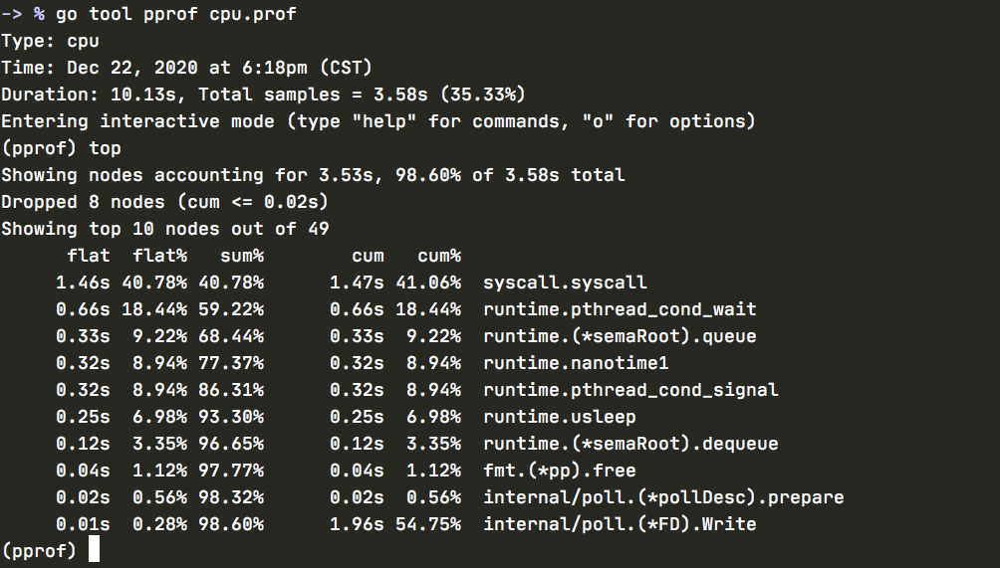


## web 分析

```
package main

import (
	"fmt"
	"net/http"
    _ "net/http/pprof"  // 第一步～
)

// 一段有问题的代码
func do() {
	var c chan int
	for {
		select {
		case v := <-c:
			fmt.Printf("我是有问题的那一行，因为收不到值：%v", v)
		default:
		}
	}
}

func main() {
	// 执行一段有问题的代码
	for i := 0; i < 4; i++ {
		go do()
	}
	http.ListenAndServe("0.0.0.0:6061", nil)
}
```

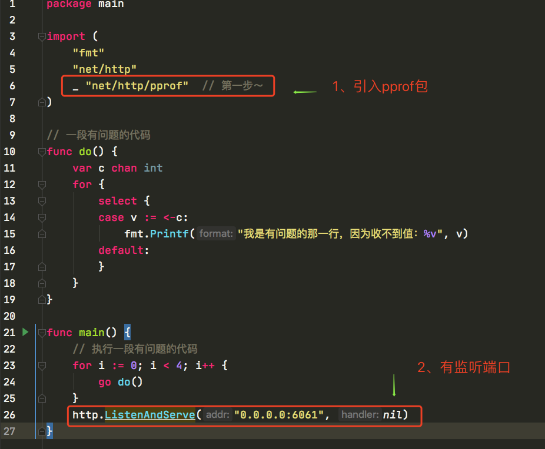


# 10、runtime.pprof编程

<font color=green size=5x>**获取CPU信息和Heap信息**</font>

```
package main

import (
	"fmt"
	"log"
	"os"
	"runtime/pprof"
	"time"
)

func do() {
	var c chan int
	for {
		select {
		case v := <-c:
			fmt.Println("有问题", v)
		default:
			fmt.Println("default")
		}

	}
}

func main() {
	var (
		file, file1 *os.File
		err         error
	)

	if file, err = os.Create("./cpu.prof"); nil != err {
		log.Fatal(err)
	}
	if file1, err = os.Create("./heap.prof"); nil != err {
		log.Fatal(err)
	}

	//1、获取CPU信息
	if err = pprof.StartCPUProfile(file); err != nil {
		log.Fatal(err)
	}
	defer pprof.StopCPUProfile()

	//2、获取heap信息
	if err = pprof.WriteHeapProfile(file1); nil != err {
		log.Fatal(err)
	}

	for i := 0; i < 4; i++ {
		go do()
	}
	time.Sleep(10 * time.Second)
}

```


